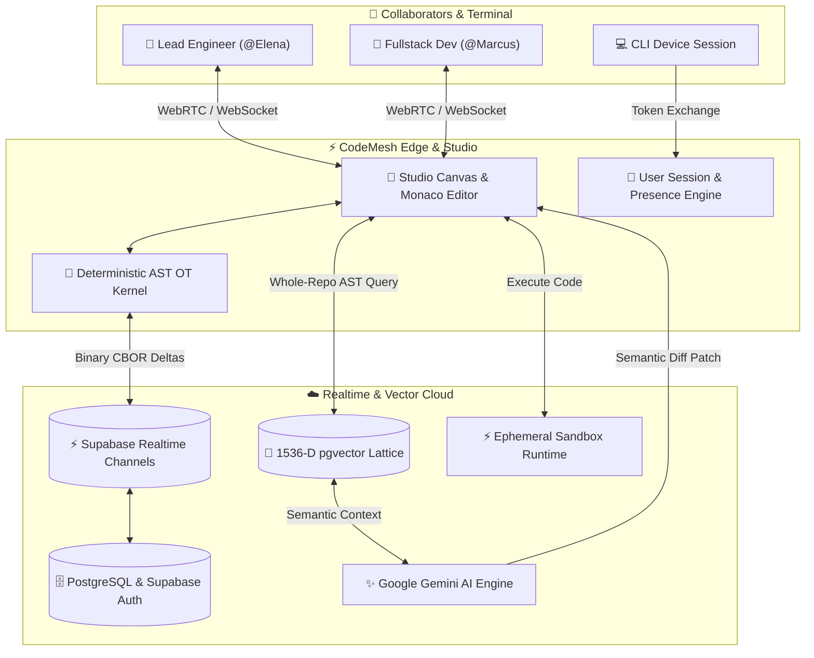

<div align="center">

# 🌐 CodeMesh 🚀
**Real-Time Collaborative Cloud IDE with Whole-Repository RAG & MicroVM Compute**

[](https://nextjs.org/)
[](https://react.dev/)
[](https://www.typescriptlang.org/)
[](https://tailwindcss.com/)
[](https://threejs.org/)
[](https://microsoft.github.io/monaco-editor/)
[](https://supabase.com/)
[](https://ai.google.dev/)

<p align="center">
Go from idea to live cloud production with an AI agent that codes and executes directly on the canvas. Featuring multi-cursor AST delta synchronization, pgvector codebase memory, and ephemeral compute sandboxes.
</p>

[**Explore Live Demo**](http://localhost:3000) • [**View Architecture RFC**](#-architecture--data-flow) • [**Getting Started**](#-getting-started)

</div>

---

## 🌟 Overview

**CodeMesh** is a next-generation cloud development environment engineered for high-performance software teams. It solves the fragmentation of modern development by combining:

1. **Deterministic Multi-User State:** No merge locks or slow git stash-and-pull loops. Every keystroke decomposes into atomic AST delta streams propagated over low-latency edge meshes.
2. **Whole-Repository AI Understanding:** Rather than blind file-by-file prompts, CodeMesh tokenizes your entire project into a 1536-dimensional pgvector memory graph powered by Google Gemini.
3. **Instant Cloud Compute:** Ephemeral Firecracker sandboxes and in-browser execution runtimes allow instant script execution in `< 150ms` with zero local environment setup.

---

## 🚀 Key Features

### ⚡ Sub-10ms AST Operational Transformation Engine
- **Deterministic Vector Clocks:** Concurrent multi-user edits are resolved syntactically with zero lock contention.
- **Binary CBOR Delta Streams:** Under 120 bytes per keystroke for instantaneous worldwide propagation.
- **Live Presence & Multi-Cursor Telemetry:** Real-time collaborator cursor tracking, active file highlights, and live typing indicators.

### 🧠 Contextual pgvector RAG Codebase Memory
- **1536-Dimensional Semantic Indexing:** Hierarchical AST node parsing across custom types, functions, and interfaces.
- **Zero-Hallucination Patches:** AI code generation references your project's active types and internal APIs without requiring manual copy-pasting.
- **Semantic Code Search:** Natural language search across multi-file repositories with cosine similarity ranking.

### 🚀 Ephemeral In-Browser & MicroVM Sandbox
- **Instant Hardware Execution:** Run Python, Node.js, and TypeScript scripts live from the integrated cloud terminal.
- **Isolated Runtimes:** Hardened container namespaces with real-time stdout and stderr log streaming.
- **Interactive Terminal Shell:** Command runner with support for `run`, `ls`, `cat`, `touch`, `rm`, `ai`, and `clear`.

### 🎨 Framer-Grade Dark Canvas UI
- **Obsidian Black Aesthetic:** Curated monochromatic palette with selective Framer accent highlights (Electric Blue `#0066FF`, Violet `#A855F7`, Amber `#FF7E33`, Emerald `#10B981`).
- **Editorial Typography:** Elegant `EB Garamond` italic flourishes paired with high-contrast `Geist` and `JetBrains Mono`.
- **3D WebGL Orbital Canvas:** Interactive Three.js particle field and wireframe lattice with smooth mouse perspective tilt.

### 🔐 Real Developer Authentication
- **Google Identity Services (GIS):** Real Google account selector with JWT credential decoding and profile picture integration.
- **GitHub OAuth:** Instant developer authentication with GitHub profile metadata.
- **Terminal CLI Device Code Flow:** Authorize browser sessions from your command line (`codemesh login --key 0x7F9A-42`).

---

## 🛠️ Architecture & Data Flow



---

## 📦 Tech Stack

| Layer | Technology | Description |
| :--- | :--- | :--- |
| **Framework** | [Next.js 16](https://nextjs.org/) + [React 19](https://react.dev/) | App Router, Server Components, Fast Refresh |
| **Language** | [TypeScript 5](https://www.typescriptlang.org/) | Strict type safety across AST models & workspace schemas |
| **Editor Core** | [Monaco Editor](https://microsoft.github.io/monaco-editor/) | Industry-standard VS Code editor kernel in the browser |
| **3D Graphics** | [Three.js](https://threejs.org/) | Procedural particle field, orbital wireframe lattice |
| **Styling** | [Tailwind CSS](https://tailwindcss.com/) + Vanilla CSS | Custom glassmorphism, Framer dot grid, mesh backgrounds |
| **Realtime & DB** | [Supabase](https://supabase.com/) | Realtime broadcast channels, Postgres database, OAuth |
| **AI & Vectors** | [Google Gemini](https://ai.google.dev/) + pgvector | 1536-D embedding generation, contextual code completions |
| **Icons & Fonts** | Google Fonts + Material Symbols | `EB Garamond`, `Geist`, `JetBrains Mono` |

---

## 📁 Project Structure

```text
CodeMesh/
├── src/
│   ├── app/
│   │   ├── api/
│   │   │   ├── ai/chat/route.ts       # Gemini AI streaming & RAG endpoint
│   │   │   └── rooms/route.ts         # Workspace room creation & management
│   │   ├── auth/
│   │   │   ├── callback/route.ts      # OAuth code exchange handler
│   │   │   └── page.tsx               # Google, GitHub, Email, & CLI Auth
│   │   ├── workspace/[id]/page.tsx    # Live Real-Time Monaco IDE Room
│   │   ├── workspaces/page.tsx        # Workspaces Dashboard
│   │   ├── globals.css                # Monochromatic mesh, dot grid, design tokens
│   │   ├── layout.tsx                 # Root layout with Google GSI & fonts
│   │   └── page.tsx                   # Framer-style SaaS Landing Page
│   │
│   ├── components/
│   │   ├── FramerExactHero.tsx        # Hero with 3D tilt studio canvas
│   │   ├── FramerNavbar.tsx           # Floating island pill navigation
│   │   ├── FramerDesignScreens.tsx    # 4 interactive product screen showcases
│   │   ├── FramerBentoGrid.tsx        # 4 interactive bento feature cards
│   │   ├── FramerTestimonialWall.tsx  # Wall of Love masonry bento grid
│   │   ├── Hero3DCanvas.tsx           # Three.js WebGL particle lattice
│   │   ├── ThreeRecurringMotif.tsx    # Recurring orbital wireframe visual
│   │   ├── WorkspaceIDE.tsx           # Monaco IDE, multi-cursor, & cloud terminal
│   │   ├── TeamDiscussionChat.tsx     # Real-time room chat with code snippets
│   │   ├── SemanticSearchVisualizer.tsx # pgvector 1536-D cosine similarity graph
│   │   ├── DemoVideoModal.tsx         # Synchronized interactive demo showcase
│   │   └── CreateRoomModal.tsx        # Workspace container provisioning modal
│   │
│   ├── lib/
│   │   ├── authSession.ts             # Session persistence & account vault
│   │   ├── codeRunner.ts              # In-browser JavaScript & Python sandbox
│   │   ├── gemini.ts                  # Google Gemini API integration
│   │   ├── roomStorage.ts             # LocalStorage & room state synchronizer
│   │   └── supabaseClient.ts          # Supabase client & realtime provider
│   │
│   └── types/
│       └── workspace.ts               # Workspace, Member, File, & Chat schemas
│
├── .env.example                       # Environment variables template
├── .env.local                         # Local environment keys
├── next.config.ts                     # Next.js configuration
├── package.json                       # Dependencies & scripts
└── tsconfig.json                      # TypeScript configuration
```

---

## ⚡ Getting Started

### Prerequisites
- **Node.js**: v18.18.0 or higher
- **npm** or **pnpm** / **yarn**

### 1. Clone the Repository
```bash
git clone https://github.com/patelhemadri456-png/Codemesh.git
cd Codemesh
```

### 2. Install Dependencies
```bash
npm install
```

### 3. Configure Environment Variables
Create a `.env.local` file in the root directory (or copy from `.env.example`):
```bash
cp .env.example .env.local
```

Fill in your configuration keys:
```env
# Supabase Configuration (from https://supabase.com/dashboard -> Project Settings -> API)
NEXT_PUBLIC_SUPABASE_URL=https://your-project-id.supabase.co
NEXT_PUBLIC_SUPABASE_ANON_KEY=your-anon-publishable-key
SUPABASE_SERVICE_ROLE_KEY=your-service-role-key

# Google Gemini AI API Key (from https://aistudio.google.com/)
GEMINI_API_KEY=your-gemini-api-key

# Optional: Google Cloud OAuth 2.0 Web Client ID
NEXT_PUBLIC_GOOGLE_CLIENT_ID=your-google-client-id.apps.googleusercontent.com
```

### 4. Start the Development Server
```bash
npm run dev
```

Open [http://localhost:3000](http://localhost:3000) in your browser.

---

## 🎯 Usage Walkthrough

1. **Explore the Landing Page:** Navigate the 3D interactive hero, test the editable canvas code runner, and switch between feature screens.
2. **Authenticate:** Go to `/auth` and sign in using Google, GitHub, Email, or the Terminal CLI device code.
3. **Manage Workspaces:** Browse active workspaces on `/workspaces`, or create a new room from templates (Python Data Science, Next.js Fullstack, Rust Systems).
4. **Collaborate in Real Time:** Open any workspace to edit code concurrently, test commands in the terminal shell, and collaborate in `#room-discussion`.
5. **Ask Gemini RAG:** Use the AI assistant panel to query your multi-file codebase with semantic context.

---

## 📜 Available Scripts

| Command | Description |
| :--- | :--- |
| `npm run dev` | Starts the Next.js development server with Turbopack |
| `npm run build` | Compiles the production build |
| `npm run start` | Runs the compiled production server |
| `npm run lint` | Runs ESLint analysis across all project files |

---

## 🛡️ License

Distributed under the MIT License. See `LICENSE` for more details.

<div align="center">
<sub>Built with precision for real-time collaborative engineering.</sub>
</div>
